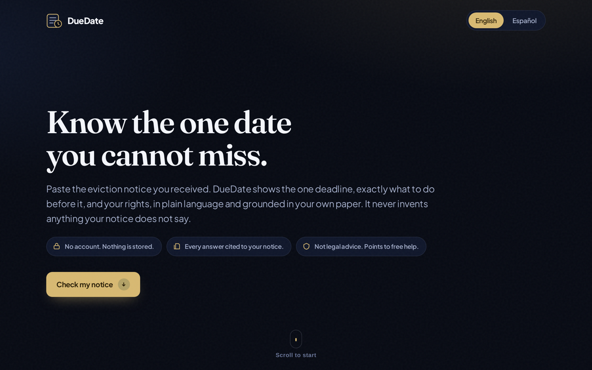
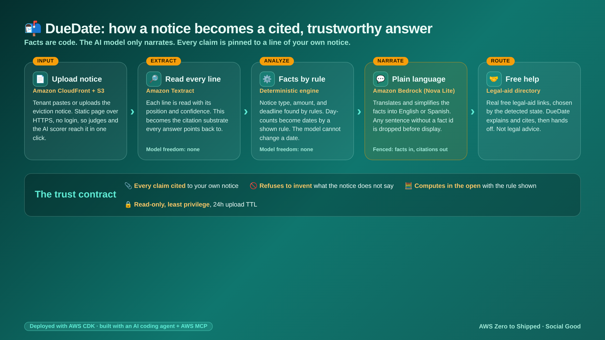
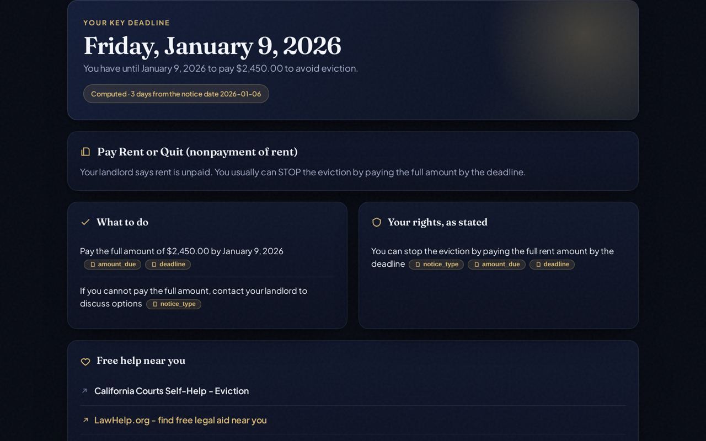
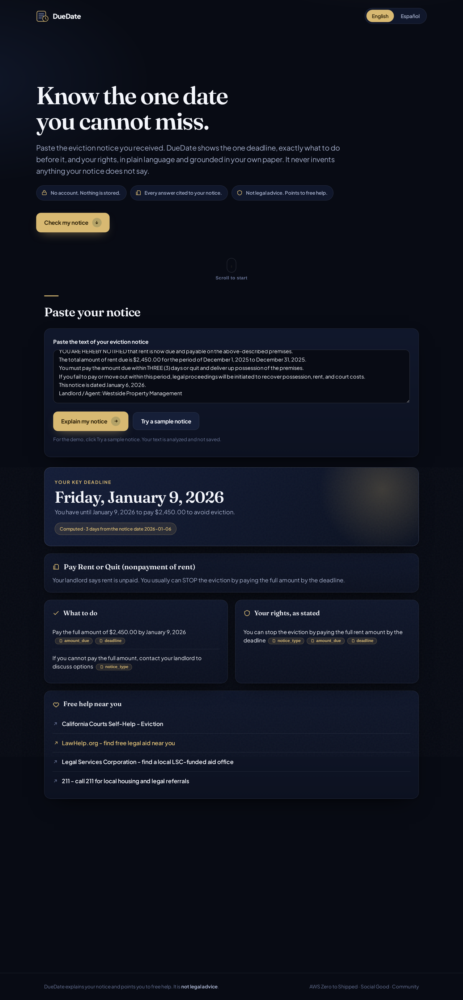

<div align="center">

# 📬 DueDate: Understand Your Eviction Notice Before the Deadline (2026)

### Paste the eviction notice you received and get, in your language, the one date you cannot miss, exactly what to do before it, and your rights - with every statement pinned to the exact line of your own notice, and a hard refuse-to-invent rule so it never tells a frightened person something their paper does not actually say.

[](https://d3pjdlu332prje.cloudfront.net)
[](https://aws.amazon.com/textract/)
[](https://aws.amazon.com/bedrock/)
[](https://kiro.dev)
[](https://aws.amazon.com/cdk/)
[](LICENSE)

[](https://d3pjdlu332prje.cloudfront.net)

**AWS Zero to Shipped** · Category: `#social-good` · Lane: `#community`



</div>

> [!IMPORTANT]
> **DueDate is not legal advice and not a lawyer.** It explains what your notice says, cites
> the exact line it read, and points you to real free legal aid. It never states a right or a
> step your notice does not actually contain. If it cannot ground an answer in your paper, it
> says so and routes you to free help. See [The Honest Take](#-the-honest-take).

---

## 🤔 The Problem

Roughly **1 in 4 eviction cases end in a default judgment**: the tenant loses not on the
merits, but because they never responded in time ([MLRI, The Default Project](https://mlri.org/publication/the-default-project/)).
The same research shows tenants facing eviction are **more likely to have a disability, to
speak a primary language other than English, and to have less access to technology.** As the
Furman Center put it, **"half the battle is just showing up."**

An eviction notice is a dense, frightening legal document with one buried fact that matters
most: a deadline. Miss it and you can lose your home.

**DueDate reads that notice and makes the one date, the required action, and your rights
impossible to miss**, in plain language and in your own language, grounded line by line in
your own paper. It is not another chatbot that might be wrong. The facts are computed by
code, not written by a model, so a date can never be hallucinated.

---

## 📬 What You Get (from one pasted notice)

Paste or upload a notice. DueDate returns a calm, cited answer in seconds.

### 🗓️ The one deadline, computed and shown
It finds the deadline, or computes it from a day-count and the notice date, and labels it
`Computed` with the exact rule used. A date is never written by the AI model.

### ✅ A dated action checklist
Concrete steps grounded in the notice: what to pay or fix, and by when. Every item carries
the fact it came from.

### 🛡️ Your rights, as stated
Only the rights the notice actually supports. Each one links back to the line that proves it.

### ❓ What your notice does NOT say
The honesty panel. If a right or amount is not in the paper, DueDate will not guess it. It
says so plainly and sends you to free legal aid.

### 🌐 In your language
English and Spanish today, from the same cited facts. The architecture adds languages
without touching the fact engine.

---

## 🧠 How It Works - facts are code, the model only narrates

<div align="center">

</div>

The whole trust story is one idea: **the model is never allowed to decide a fact.**

| Layer | Who decides | What happens |
|-------|-------------|--------------|
| **Extract** | Amazon Textract | Every line of the notice is read with its position and confidence. This is the citation substrate. |
| **Analyze** | Deterministic engine (code) | Notice type, deadline, amount, and parties are found by rules. Day-counts become dates by a documented rule. Each fact cites the line it came from. The model cannot change a date. |
| **Narrate** | Amazon Bedrock, under guardrails | The model only translates and simplifies the facts it is given. Any sentence without a backing fact id is dropped before display. |
| **Route** | Static directory | Real free legal-aid links, chosen by the detected state. |

`Extract` and `Analyze` run with zero model freedom. `Narrate` is the only generative step,
and it is fenced in on both sides: constrained to the facts going in, filtered for citations
coming out.

---

## 📸 What it looks like (live, real)

Every screenshot is a real run against the live app. The sample notice is illustrative, but
the extraction, the computed deadline, and the citations are real.

### The one deadline, with the computed rule shown
<div align="center">

</div>

### The full result: checklist, rights, the honesty panel, free help, and your cited notice
<div align="center">

</div>

---

## 🔥 The Three Trust Beats

### 📎 Beat 1 - Every answer is cited to your own notice
Click any `📎` chip and the exact line of your notice scrolls into view and highlights. No
claim appears without a line behind it. In the API, every `Fact` carries a `cites` array of
line ids, and the UI drops any narration sentence whose `cite` is not a real fact.

### 🚫 Beat 2 - It refuses to invent
No deadline in the paper means no deadline on screen. A day-count with no start date is
reported honestly as "days only", never guessed into a fake date. Proven by the test suite
(`test_R7_never_invents_a_date`, `test_R10_refuses_when_only_a_day_count`).

### 🧮 Beat 3 - It computes in the open
When the deadline is a day-count ("within 3 days"), DueDate computes the date and shows the
rule on screen: `Computed - 3 days from the notice date 2026-01-06`. Nothing is hidden, so
the user (or a lawyer) can check the arithmetic.

---

## 🛠️ Tech Stack

| Layer | Choice |
|-------|--------|
| Document extraction | Amazon Textract (`DetectDocumentText`, lines + geometry + confidence) |
| Deterministic engine | Python rules: notice-type classification, deadline math, cited facts |
| Narration + translation | Amazon Bedrock, Amazon Nova Lite (`us.amazon.nova-2-lite-v1:0`) |
| API | AWS Lambda (Python 3.12) + Lambda Function URL (public HTTPS, no login) |
| Front end | Static HTML served by Amazon CloudFront over private Amazon S3 (OAC) |
| Uploads | Amazon S3 bucket with a 24 hour lifecycle TTL |
| IaC | AWS CDK (Python) |
| Build | Kiro CLI connected to AWS via the Agent Toolkit and AWS MCP servers |

---

## 🏛️ Architecture in Detail

<div align="center">

</div>

DueDate is a two-tier serverless app. The browser only ever talks to CloudFront; the Lambda
Function URL is the only compute. Nothing is a long-running server, so it costs near zero at
idle and scales to zero.

### The request path, end to end

```
Browser (CloudFront, static HTML + JS)
   |
   |  POST { text | s3 | image_b64, language, state }   (HTTPS, no auth)
   v
Lambda Function URL  --->  handler.py
   |
   |  1. extract.py   Textract DetectDocumentText    -> Line[] (id, text, confidence)
   |  2. engine.py    rules only, no model           -> facts[] each with cites[]
   |  3. detect state from the address text
   |  4. aid.py       pick real free legal-aid links  -> resources[]
   |  5. narrate.py   Bedrock Nova Lite, guardrailed  -> grounded summary/checklist/rights
   v
JSON  { notice_type, facts[], missing[], resources[], narration, lines[], disclaimer }
```

### The data contract (what the API returns)

Every answer is a `Fact`, and every `Fact` either cites a line of the user's own notice or
is marked absent. This is the shape the front end renders and the tests assert against:

```json
{
  "notice_type": "pay_or_quit",
  "notice_type_label": "Pay Rent or Quit (nonpayment of rent)",
  "facts": [
    { "key": "notice_type", "value": "pay_or_quit", "cites": ["L1","L4","L6"] },
    { "key": "amount_due",  "value": "$2,450.00",  "cites": ["L5"] },
    { "key": "deadline",    "value": "2026-01-09",  "cites": ["L6","L8"],
      "computed": true, "rule": "3 days from the notice date 2026-01-06" }
  ],
  "missing": [],
  "state": "CA",
  "resources": [ { "name": "California Courts Self-Help - Eviction", "url": "..." } ],
  "narration": {
    "summary": "You have until January 9, 2026 to pay $2,450.00 to stop the eviction.",
    "checklist": [ { "text": "Pay $2,450.00 before the deadline.", "cite": ["amount_due","deadline"] } ],
    "rights":    [ { "text": "You can stop the eviction by paying the full rent owed.", "cite": ["notice_type"] } ],
    "grounded": true
  },
  "lines": [ { "id": "L1", "text": "THREE-DAY NOTICE TO PAY RENT OR QUIT", "confidence": 99.4 } ],
  "disclaimer": "DueDate explains your notice and points you to free help. It is not legal advice."
}
```

### How the deadline is computed (worked example)

The sample notice says "within THREE (3) days" and "dated January 6, 2026". The engine does
not ask the model for a date. It:
1. Reads the day-count `3` from the line that contains it (cited).
2. Reads the notice date `2026-01-06` from the "dated" line (cited).
3. Adds 3 calendar days (the notice did not say business days) and labels the result
   `computed`, exposing the rule on screen: `3 days from the notice date 2026-01-06`.

If either input is missing, it does **not** guess. It reports the day-count alone, or says
the notice has no clear deadline, and routes the user to free help.

---

## 🚀 Getting Started

### Try the live app (no install, no account)

> **https://d3pjdlu332prje.cloudfront.net**

Open it, click **Check my notice** (or scroll down), then **Try a sample notice**.

### Prove the trust contract locally (no AWS needed)

The deterministic engine runs with zero AWS calls, so you can prove the guarantees in
seconds:

```bash
git clone https://github.com/simplynadaf/duedate.git
cd duedate
python3 tests/test_engine.py        # 8 trust-contract tests, no AWS needed
```

Expected: `8/8 passed`, including `test_R7_never_invents_a_date` and
`test_R10_refuses_when_only_a_day_count`.

### Call the live API directly

```bash
curl -s -X POST "$DUEDATE_API_URL" \
  -H 'Content-Type: application/json' \
  -d '{"text":"THREE-DAY NOTICE TO PAY RENT OR QUIT\nThe total amount due is $2,450.00.\nYou must pay within THREE (3) days or quit.\nThis notice is dated January 6, 2026.","language":"en"}'
```

The response carries the deterministic `facts` (each with its `cites`), the guardrailed
`narration`, and the real `resources` for the detected state.

<details>
<summary>Deploy your own copy with AWS CDK</summary>

```bash
cd infra
python3 -m venv .venv && . .venv/bin/activate
pip install aws-cdk-lib constructs
npx aws-cdk bootstrap          # once per account/region
npx aws-cdk deploy             # prints the live Site URL and API URL
```

You need Amazon Bedrock model access (Nova Lite) and Amazon Textract enabled in
`us-east-1`. The Lambda role is least-privilege: `textract:DetectDocumentText` and
`bedrock:InvokeModel` only.
</details>

---

## 📁 Project Structure

```
duedate/
├── backend/
│   ├── engine.py            # deterministic trust engine: classify, extract, compute deadline, cite
│   ├── narrate.py           # Amazon Bedrock narration + translation, guardrailed to the facts
│   ├── extract.py           # Amazon Textract adapter (plus plain-text fallback for samples)
│   ├── aid.py               # real free legal-aid directory with per-state hooks
│   └── handler.py           # Lambda: extract -> analyze -> narrate -> route, with CORS
├── frontend/
│   ├── index.html           # one-page, WCAG-AA, bilingual UI (two-view: hero then paste)
│   ├── favicon.svg
│   └── og.png               # social share image
├── infra/
│   ├── app.py               # AWS CDK stack: Lambda URL, S3 + CloudFront, TTL uploads, IAM
│   └── cdk.json
├── tests/
│   └── test_engine.py       # 8 trust-contract tests (no invented facts, refuses when unsupported)
├── spec/
│   └── duedate.md           # EARS requirements, written before the code
├── samples/
│   └── pay_or_quit_ca.txt   # a realistic California 3-day notice for the demo
├── docs/
│   ├── aws-architecture.png # the AWS high-level architecture diagram
│   ├── architecture.png     # the conceptual How It Works diagram
│   ├── architecture.html    # diagram source (Playwright-rendered)
│   ├── proof.md             # proof the coding agent connected to AWS + the deploy
│   └── screenshots/         # live-app screenshots used in this README
├── .kiro/steering/
│   └── product.md           # the steering doc that tailored the coding agent
└── LICENSE
```

---

## 🔐 Least-Privilege IAM

The API Lambda touches almost nothing in the account. Its role grants exactly
`textract:DetectDocumentText` / `AnalyzeDocument` and `bedrock:InvokeModel` /
`InvokeModelWithResponseStream`, plus read on its own short-TTL uploads bucket. The static
site bucket blocks all public access; only CloudFront reads it through Origin Access Control.
Uploaded documents auto-delete within 24 hours. There is no login and no tracking on the
critical path.

---

## ⚖️ Built With a Coding Agent on AWS

DueDate was built end to end with **Kiro CLI** connected to AWS through the Agent Toolkit and
AWS MCP servers. The agent wrote the engine and tests, authored the CDK, deployed the stack,
and verified the live app against real Amazon Textract and Amazon Bedrock calls. The path was
deliberately spec-driven: a steering doc, then an EARS spec, then code, then tests, then
infrastructure as code. Proof of the agent-to-AWS connection and the deploy outputs is in
[`docs/proof.md`](docs/proof.md).

---

## 🧾 The Honest Take

A tool that speaks to frightened people must not overclaim. So, plainly:

- **This is not legal advice.** DueDate explains and cites your notice and routes you to free
  legal aid. A lawyer decides your case, not this app.
- **Extraction can misread.** Textract is strong but not perfect on photos of paper. DueDate
  shows confidence and lets you see the exact line, so you can check it against the original.
- **The rule base is scoped.** Notice-type and deadline rules cover common United States
  cases. Where a rule does not apply, DueDate says the deadline "varies, confirm with free
  help" rather than guessing.
- **Jurisdiction detection is best-effort.** It reads the state from the address text. If it
  is unsure, it falls back to national free-aid resources.
- **The model only narrates.** No date or amount comes from the model. If a fact is wrong, it
  is the deterministic engine to fix, not a prompt.

These limits are the point. The honesty panel and the refuse-to-invent rule exist precisely
because the reader often cannot check the answer themselves.

---

## 🎬 Video Tutorial & Article

- 📺 Video: _coming soon_
- 📝 Article: _coming soon_

---

## 🤝 Contributing

Issues and PRs welcome. The deterministic engine and its tests are the heart of the project;
new notice types and new jurisdictions are the most useful contributions.

---

## 📝 License

Apache License 2.0 - see [LICENSE](LICENSE).

---

<div align="center">

Built for the **AWS Zero to Shipped** hackathon · Social Good · Community

Made with care by [Sarvar](https://sarvarnadaf.com)

[](https://www.linkedin.com/in/sarvar04/)
[](https://github.com/simplynadaf)
[](https://dev.to/sarvar_04)

</div>
